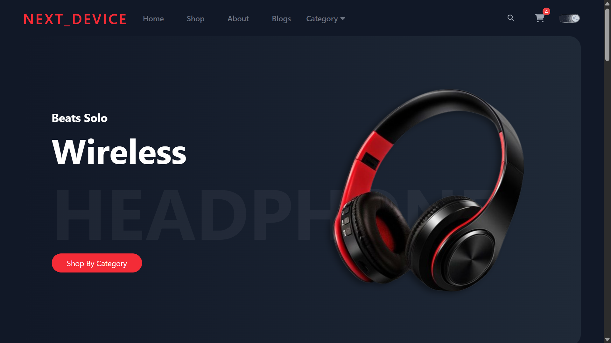
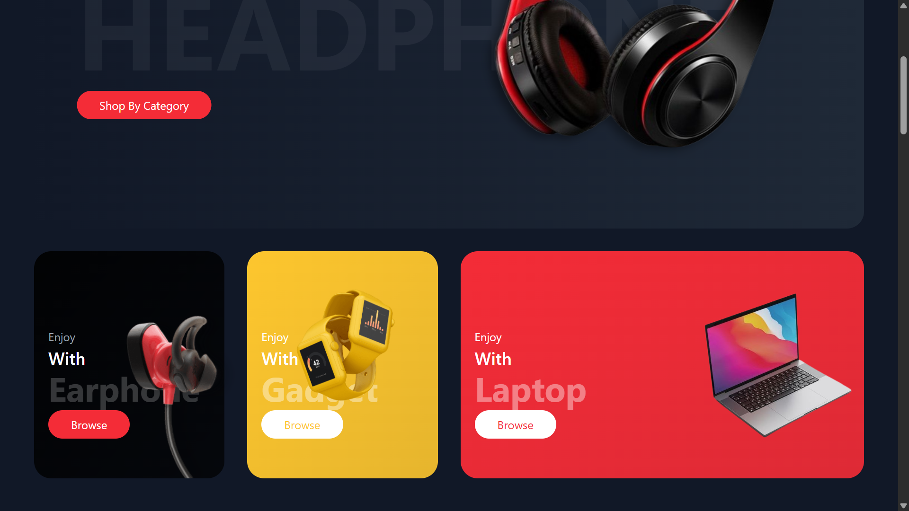
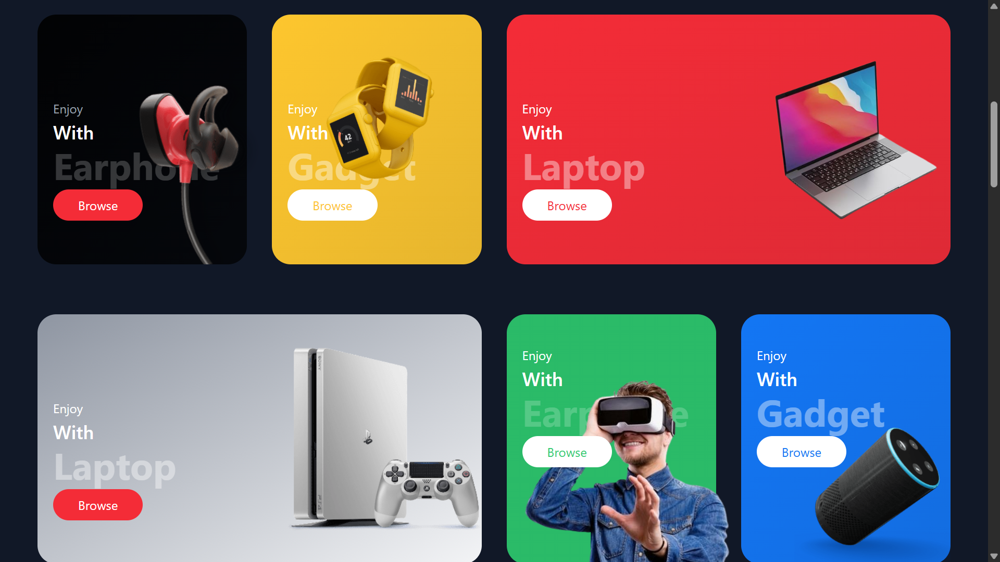
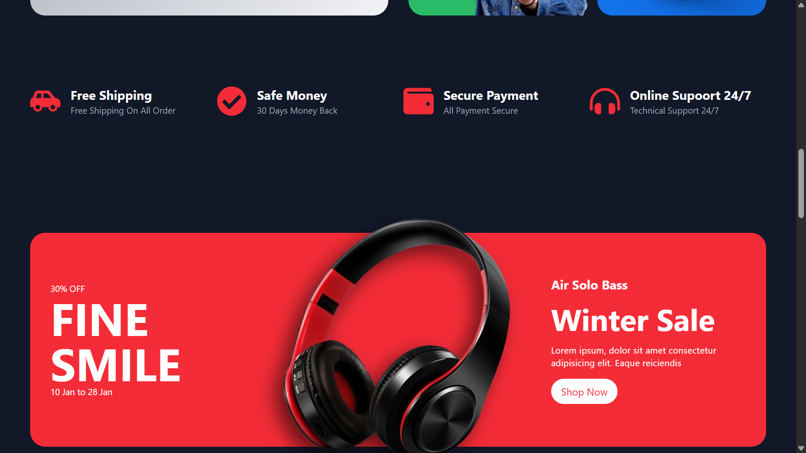
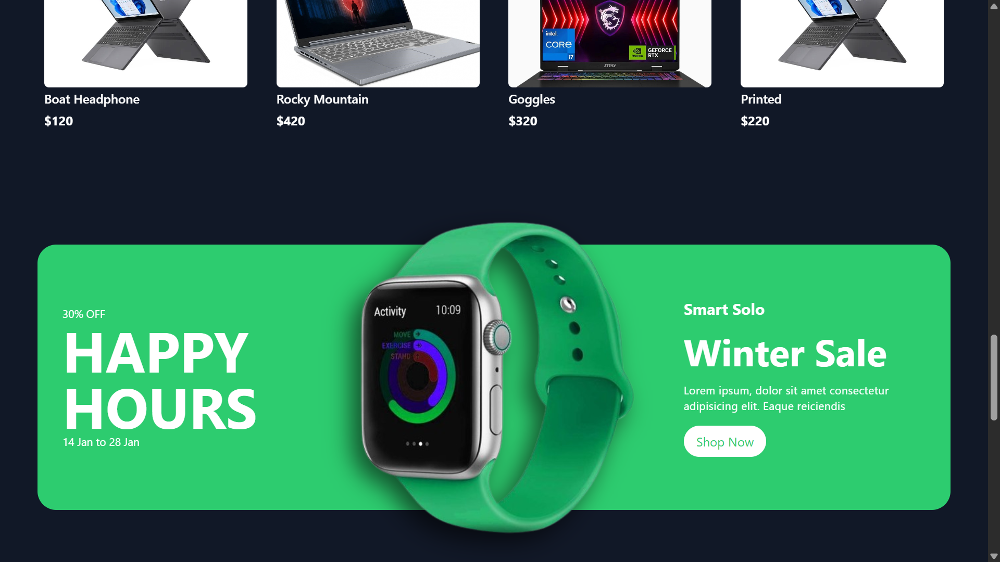
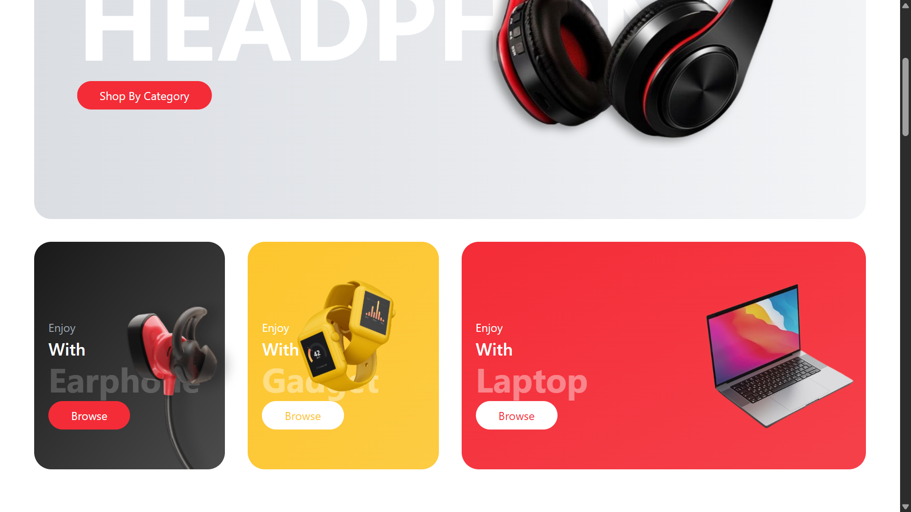
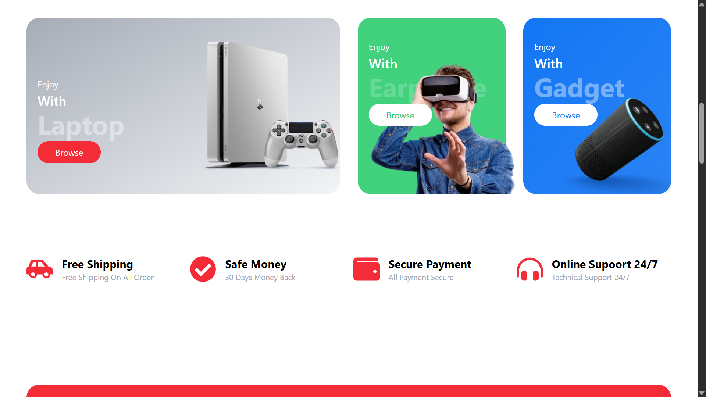
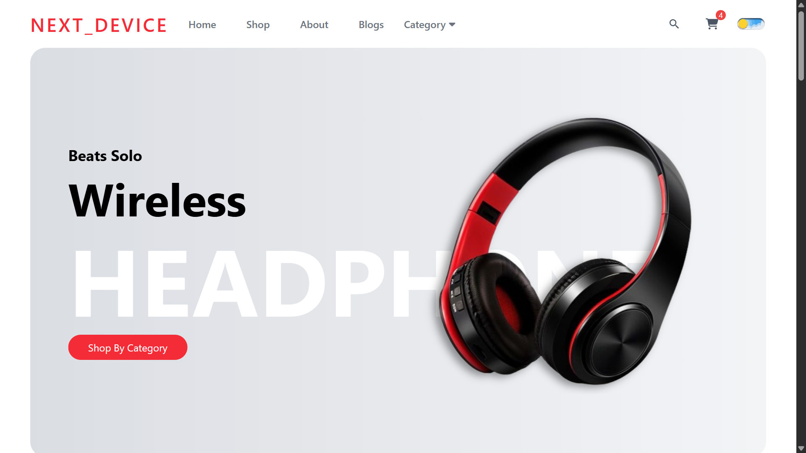
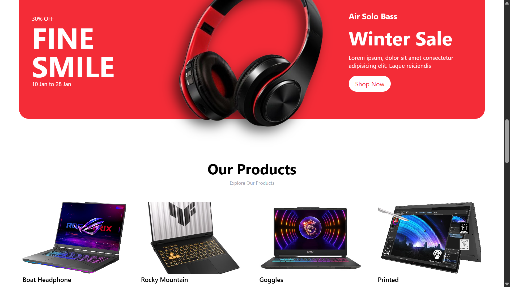
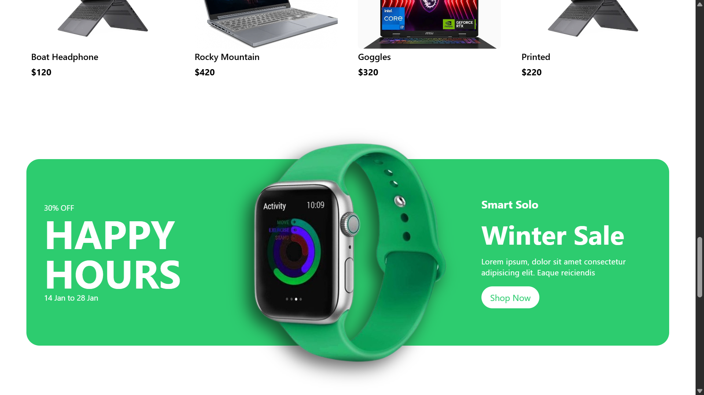

# Next_Device — Electronics E-Commerce Website

<div align="center">

**A fully responsive, single-page electronics e-commerce website built with React, Vite, and Tailwind CSS.**

[Report Bug](../../issues) · [Request Feature](../../issues)

</div>

---

## Table of Contents

- [Overview](#overview)
- [Features](#features)
- [Screenshots](#screenshots)
- [Technologies Used](#technologies-used)
- [Project Structure](#project-structure)
- [Getting Started](#getting-started)
- [Components](#components)
- [Themes](#themes)
- [Future Enhancements](#future-enhancements)
- [Contributing](#contributing)
- [License](#license)

---

## Overview

**Next_Device** is a modern, fully responsive single-page e-commerce website for an electronics and gadgets store. Built with **React 18**, **Vite**, and **Tailwind CSS**, it delivers a polished shopping experience across all devices — desktops, tablets, and mobile phones.

The project features smooth scroll animations powered by **AOS (Animate On Scroll)**, a product carousel via **react-slick**, support for **Dark and Light modes**, multiple product category sections (Earphones, Gadgets, Laptops, VR, Gaming, Speakers), promotional banners, a blog section, brand partners strip, and an order popup modal.

---

## Features

- 🌑 **Dark & Light Mode** — Toggle between themes; preference persisted in `localStorage`
- 📱 **Fully Responsive** — Optimised for mobile, tablet, and desktop viewports via Tailwind CSS
- 🎠 **Hero Slider** — Auto-playing product carousel built with `react-slick`
- 🛍️ **Product Categories** — Two category grid rows: Earphone, Watch, Laptop, Gaming, VR, Speaker
- 🛒 **Shopping Cart UI** — Cart icon with item count badge in the navbar
- 📦 **Products Section** — 8-product grid (two rows of 4) with hover "Add to Cart" overlay
- 🎯 **Promotional Banners** — Two dynamic sale banners with configurable discount, date, image, and accent colour
- ✅ **Services Section** — Trust badges: Free Shipping, Safe Money, Secure Payment, 24/7 Online Support
- 📰 **Blog Section** — Three latest blog posts with image, title, subtitle, and author
- 🤝 **Brand Partners** — Logos strip for partner brands (hidden on mobile)
- 🪟 **Order Popup Modal** — Modal form with Name, Email, and Address fields triggered from navbar and hero CTA
- 🎨 **AOS Animations** — Smooth entrance animations on scroll throughout the page
- 🔍 **Search Bar** — Inline search input in the navbar (desktop)
- 📂 **Category Dropdown** — Navbar dropdown for Brand New, Used, and Best Selling product filters

---

## Screenshots

### 🌑 Dark Mode

| Hero Section | Category Cards |
|:---:|:---:|
|  |  |

| Promo Banners | Product Grid |
|:---:|:---:|
|  |  |

| Sale Banner |  |
|:---:|:---:|
|  | |

---

### ☀️ Light Mode

| Hero Section | Category Cards |
|:---:|:---:|
|  |  |

| Trust Badges & Promo | Product Grid |
|:---:|:---:|
|  |  |

| Promo Section |  |
|:---:|:---:|
|  | |

> **Note:** To reproduce locally, run the dev server and toggle the dark/light switch in the top-right corner of the navbar.

---

## Technologies Used

| Technology | Version | Purpose |
|---|---|---|
| **React** | 18.2.0 | UI component library |
| **Vite** | 5.0.8 | Development server and build tool |
| **Tailwind CSS** | 3.4.1 | Utility-first CSS framework |
| **AOS** | 2.3.4 | Animate-on-scroll library |
| **react-slick** | 0.29.0 | Hero image carousel/slider |
| **slick-carousel** | 1.8.1 | CSS/font assets for react-slick |
| **react-icons** | 5.0.1 | Icon set (FontAwesome, IoIcons, etc.) |
| **PostCSS** | 8.4.33 | CSS post-processing |
| **Autoprefixer** | 10.4.17 | Vendor prefix automation |
| **ESLint** | 8.55.0 | Code linting |

---

## Project Structure

```
Next_Device/
│
├── index.html                        # App entry HTML
├── vite.config.js                    # Vite configuration
├── tailwind.config.js                # Tailwind CSS config (custom colors, container)
├── postcss.config.js                 # PostCSS config
├── package.json                      # Dependencies and scripts
├── .eslintrc.cjs                     # ESLint configuration
│
├── public/
│   └── vite.svg                      # Favicon
│
└── src/
    ├── main.jsx                      # React DOM entry point
    ├── App.jsx                       # Root component — assembles all sections
    ├── App.css                       # Global app styles
    ├── index.css                     # Tailwind directives & base styles
    │
    ├── assets/
    │   ├── logo.png                  # Site logo
    │   ├── hero/                     # Hero slider images (headphone, watch)
    │   ├── category/                 # Category card images (earphone, watch, macbook, vr, gaming, speaker, smartwatch)
    │   ├── product/                  # Product grid images (p-1 to p-9)
    │   ├── blogs/                    # Blog post images (blog-1 to blog-3)
    │   ├── brand/                    # Partner brand logos (br-1 to br-5)
    │   ├── website/                  # UI assets (dark/light mode toggle buttons)
    │   └── images/                   # Screenshots for README documentation
    │
    └── components/
        ├── Navbar/
        │   ├── Navbar.jsx            # Top navigation bar with search, cart, dark mode toggle
        │   └── DarkMode.jsx          # Dark/light theme toggle (persists to localStorage)
        ├── Hero/
        │   └── Hero.jsx              # Auto-playing hero image slider (react-slick)
        ├── Category/
        │   ├── Category.jsx          # First category row: Earphone, Watch/Gadget, Laptop
        │   └── Category2.jsx         # Second category row: Gaming, VR, Speaker
        ├── Services/
        │   └── Services.jsx          # Trust badges: Shipping, Money-back, Payment, Support
        ├── Banner/
        │   └── Banner.jsx            # Reusable promotional banner (used twice in App.jsx)
        ├── Products/
        │   ├── Products.jsx          # Products section with heading and two product rows
        │   └── ProductCard.jsx       # Reusable product card with hover "Add to Cart" button
        ├── Blogs/
        │   └── Blogs.jsx             # Latest blog posts grid (3 cards)
        ├── Partners/
        │   └── Partners.jsx          # Brand partner logos strip (desktop only)
        ├── Footer/
        │   └── Footer.jsx            # Footer with links, contact info, social media icons
        ├── Popup/
        │   └── Popup.jsx             # Order popup modal (Name / Email / Address form)
        └── Shared/
            ├── Button.jsx            # Reusable button component
            └── Heading.jsx           # Reusable section heading component
```

---

## Getting Started

### Prerequisites

- **Node.js** 18 or higher
- **npm** 9 or higher (comes with Node.js)

### Installation

1. **Clone the repository**
   ```bash
   git clone https://github.com/your-username/next-device.git
   ```

2. **Navigate into the project folder**
   ```bash
   cd next-device
   ```

3. **Install dependencies**
   ```bash
   npm install
   ```

4. **Start the development server**
   ```bash
   npm run dev
   ```

5. **Open in browser**
   
   Vite will print the local URL (usually `http://localhost:5173`). Open it in any modern browser.

### Available Scripts

| Script | Command | Description |
|--------|---------|-------------|
| Dev server | `npm run dev` | Start Vite HMR development server |
| Build | `npm run build` | Production build to `dist/` |
| Preview | `npm run preview` | Preview the production build locally |
| Lint | `npm run lint` | Run ESLint on all `.js` and `.jsx` files |

---

## Components

### `App.jsx`
The root component that composes the entire single-page layout in order:
`Navbar` → `Hero` → `Category` → `Category2` → `Services` → `Banner` (red) → `Products` → `Banner` (green) → `Blogs` → `Partners` → `Footer` → `Popup`

It also initialises AOS animations and manages the `orderPopup` open/close state.

### `Navbar`
- **Logo** — `Next_Device` text link
- **Menu links** — Home, Shop, About, Blogs
- **Category dropdown** — Brand New Products, Used Products, Best Selling Products
- **Search bar** — Visible on `sm` screens and up
- **Cart icon** — With a hardcoded badge count of 4
- **Dark/Light toggle** — Switches `dark` class on `<html>` and persists to `localStorage`

### `Hero`
A `react-slick` carousel cycling through three slides: Wireless Headphone, Wireless Virtual (VR), and Branded Laptops. Each slide has subtitle text, a heading, and a "Shop Now" CTA button that triggers the Order Popup.

### `Category` & `Category2`
Two rows of product category cards using gradient backgrounds and product imagery. Categories covered: **Earphone**, **Watch/Gadget**, **Laptop**, **Gaming**, **VR**, **Speaker**.

### `Services`
Four trust indicators laid out in a 2×2 (mobile) / 4-column (desktop) grid using `react-icons`: Free Shipping, Safe Money (30 Days Money Back), Secure Payment, Online Support 24/7.

### `Banner`
A fully configurable promotional banner accepting `data` props: `discount`, `title`, `date`, `image`, `title2`, `title3`, `title4`, `bgColor`. Used for the "Fine Smile / Air Solo Bass" (red) and "Happy Hours / Smart Solo" (green) sales.

### `Products`
Two rows of 4 product cards each. Cards display product image, title, and price. On hover, a blurred overlay with an "Add to Cart" button appears.

### `Blogs`
Three blog post cards with image, title, subtitle snippet, and publication date/author ("Jan 20, 2026 by Hirusha").

### `Partners`
A 5-column logo strip (hidden on mobile) featuring brand partner logos with reduced opacity and dark-mode invert.

### `Footer`
Three-column layout: brand description column, important links (Home, About, Contact, Blog), and contact details (phone number, address) with social media icons (Facebook, Instagram, LinkedIn).

### `Popup`
A centred modal overlay triggered by the cart button or hero CTA. Contains Name, Email, and Address input fields plus an "Order Now" button. Dismissible via the ✕ icon.

---

## Themes

The site ships with **two themes** toggled via the button in the top-right of the navbar:

| Theme | Background | Accent |
|---|---|---|
| **Light** (default) | White / light grey | Red `#f42c37` |
| **Dark** | `gray-900` / `gray-950` | Red `#f42c37` |

Theme preference is stored in `localStorage` under the key `"theme"` and reapplied on every page load by toggling the `dark` class on the `<html>` element (Tailwind CSS `darkMode: "class"` strategy).

### Custom Tailwind Colours

| Variable | Hex | Usage |
|---|---|---|
| `primary` / `secondary` | `#f42c37` | Buttons, icons, accents |
| `brandYellow` | `#fdc62e` | Gadget category card |
| `brandGreen` | `#2dcc6f` | Green sale banner, VR category card |
| `brandBlue` | `#1376f4` | Speaker category card |
| `brandWhite` | `#eeeeee` | Light background surfaces |

---

## Future Enhancements

- [ ] **React Router** — Multi-page routing for Shop, About, Blog, Product Detail pages
- [ ] **Backend Integration** — REST API (Node.js / Django) for real product data
- [ ] **Authentication** — User registration, login, and profile management
- [ ] **Dynamic Cart** — Full add-to-cart, quantity update, and remove functionality with persistent state
- [ ] **Payment Gateway** — Stripe or PayHere integration
- [ ] **Live Search** — Instant search results from a product database
- [ ] **Wishlist** — Save favourite products across sessions
- [ ] **Product Reviews & Ratings** — User-generated review system
- [ ] **Admin Dashboard** — Inventory and order management panel
- [ ] **PWA Support** — Offline-capable progressive web app

---

## Contributing

Contributions are welcome! Here's how to get started:

1. Fork the project
2. Create your feature branch
   ```bash
   git checkout -b feat/amazing-feature
   ```
3. Commit your changes
   ```bash
   git commit -m 'feat: add amazing feature'
   ```
4. Push to the branch
   ```bash
   git push origin feat/amazing-feature
   ```
5. Open a Pull Request

Please follow the [Conventional Commits](https://www.conventionalcommits.org/) format for all commit messages.

---

## License

Distributed under the MIT License. See `LICENSE` for more information.

---

<div align="center">
  Made with ❤️ by <a href="https://github.com/your-username">Your Name</a>
</div>
